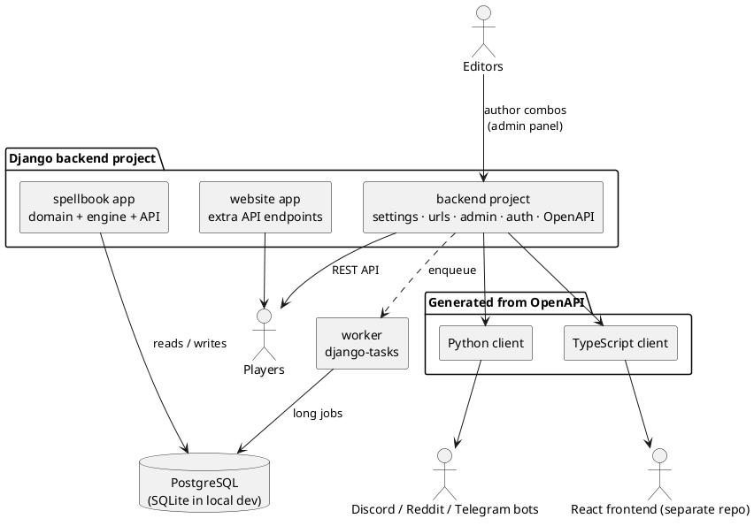

# Architecture

Commander Spellbook is a monorepo. This page explains the moving parts and how they depend on one another, so you know where a change belongs.

## The big picture

The **backend** exposes a REST API and an admin panel. Editors author combos in the admin; the **worker** runs the [variant generation engine](variant-generation.md) to derive concrete variants; players read the results through the API — directly, through the website, or through the bots.

## Repository layout

| Path | What lives here |
|------|-----------------|
| [`backend/`](https://github.com/SpaceCowMedia/commander-spellbook-backend/tree/master/backend) | The Django project. See [Backend internals](#backend-internals). |
| [`common/`](https://github.com/SpaceCowMedia/commander-spellbook-backend/tree/master/common) | Pure-Python utilities shared by the backend **and** the bots (text/color helpers, constants). Kept dependency-light so bots can import it. |
| [`client/`](https://github.com/SpaceCowMedia/commander-spellbook-backend/tree/master/client) | OpenAPI schema plus the scripts and generated Python/TypeScript SDKs. See [API & Clients](api.md). |
| [`bot/`](https://github.com/SpaceCowMedia/commander-spellbook-backend/tree/master/bot) | The `discord/`, `reddit/`, and `telegram/` bots — independent services that consume the API via the generated Python client. |
| [`demo/`](https://github.com/SpaceCowMedia/commander-spellbook-backend/tree/master/demo) | Fixtures and sample data dumps for local experimentation. |
| [`docs/`](https://github.com/SpaceCowMedia/commander-spellbook-backend/tree/master/docs) | These pages, plus the combo-graph explainer assets. |
| Root | `docker-compose*.yml`, `deploy.sh`, `git-release`, CI workflows under `.github/`. |

## Backend internals

Everything under `backend/` is one self-contained Django project made of three apps.

### `backend` — the project package

The Django project itself: settings, root URL configuration, authentication, the admin site chrome, and the OpenAPI wiring.

- `settings.py` — local/dev settings (SQLite, `DEBUG=True`), so a clone runs with no external database.
- `production_settings.py` — Postgres via `SQL_*` env vars, used in Docker/prod.
- `worker_settings.py` — production settings plus a DB statement timeout, used by the background worker.
- `urls.py` — mounts the app routers, JWT and social auth, the admin, and the `drf-spectacular` schema/Swagger/Redoc endpoints.

### `spellbook` — the core app

The domain model, the variant engine, and the primary REST API. Notable subpackages:

| Subpackage | Responsibility |
|------------|----------------|
| `models/` | The [domain model](domain-model.md): Card, Feature, Combo, Template, Variant, Suggestions, and their join tables. |
| `variants/` | The [variant generation engine](variant-generation.md): the combo graph and set algebra. Ships `.pxd` stubs for optional Cython compilation. |
| `views/` | DRF viewsets and API views (`variants`, `cards`, `features`, `find-my-combos`, `estimate-bracket`, suggestions, ...). |
| `serializers/` | DRF serializers, including pre-serialized/denormalized variant output for fast reads. |
| `tasks/` | `django-tasks` background jobs: variant generation, Scryfall card sync, exports, notifications. |
| `management/commands/` | `manage.py` entry points that enqueue those tasks (`update_variants`, `update_cards`, `export_variants`, `combo_of_the_day`). |
| `parsers/` & `transformers/` | [Lark](https://github.com/lark-parser/lark) grammars and transformers for the Scryfall-style search query language used by the API and by Template matching. |
| `admin/` | The admin panel where editors author and review combos. |

### `website` — site-support API

Extra endpoints that back the website but are not part of the core combo model — site `properties`, and card-list parsing helpers (`card-list-from-url`, `card-list-from-text`).

## Background work

Long-running operations do not block API requests; they are enqueued as [`django-tasks`](https://github.com/RealOrangeOne/django-tasks) jobs and executed by a separate worker process (`python manage.py db_worker`, the `worker` Docker target). The heavy jobs are variant generation and the periodic Scryfall card sync. Task results are visible in the admin panel.

## Data flow: from combo to variant

1. An editor creates **Cards**, **Features**, **Templates**, and **Combos** in the admin panel.
2. `update_variants` enqueues a generation job. The worker builds the [combo graph](variant-generation.md) and derives every valid **Variant**.
3. Variants are denormalized/pre-serialized and stored for fast reads.
4. The API serves variants; the website and bots consume them.

Read the [Domain Model](domain-model.md) next for the vocabulary, then [Variant Generation](variant-generation.md) for step 2 in depth.
