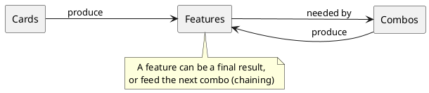

# Variant Generation

This is the heart of the project. Editors author a few hundred **combos**; the engine derives the tens of thousands of concrete **variants** that the site serves. The code lives in [`backend/spellbook/variants/`](https://github.com/SpaceCowMedia/commander-spellbook-backend/tree/master/backend/spellbook/variants).

There is an animated explainer of the algorithm — a good visual companion to this page:

<video controls width="100%">
<source src="combo_graph_explained.mp4" type="video/mp4">
Your browser does not support the video tag. Download the explainer: <a href="combo_graph_explained.mp4">combo_graph_explained.mp4</a>.
</video>

## The problem

A combo like *"Isochron Scepter + Dramatic Reversal"* really means *"Isochron Scepter imprinting an instant that untaps your mana rocks, plus enough rocks to make net mana"*. Cards produce **features**, combos **need** and **produce** features, and features can be satisfied many different ways. Enumerating every valid, **minimal** card set that reaches a result by hand is impossible. So we model it as a graph and compute it.

## The combo graph

The engine builds a graph ([`combo_graph.py`](https://github.com/SpaceCowMedia/commander-spellbook-backend/blob/master/backend/spellbook/variants/combo_graph.py)) whose nodes are **Cards**, **Features**, **Combos**, and **Templates**, wired by the [domain model](domain-model.md) relationships:



Every node is associated with a **`VariantSet`**: the set of concrete card/template combinations that can "reach" that node. Because a card may be needed in multiple copies, combinations are **multisets** ([`multiset.py`](https://github.com/SpaceCowMedia/commander-spellbook-backend/blob/master/backend/spellbook/variants/multiset.py)), not plain sets.

## The set algebra

Two operations combine variant sets ([`variant_set.py`](https://github.com/SpaceCowMedia/commander-spellbook-backend/blob/master/backend/spellbook/variants/variant_set.py)):

- **OR = union.** A feature can be produced by *any* of several providers (cards or combos), so a feature's variant set is the **union** of its providers' sets.
- **AND = cross-product.** A combo needs *all* of its ingredients at once, so its variant set is the **Cartesian product** of the variant sets of everything it needs — each combination merged into one card set.

These two operations, applied recursively over the graph, produce every card combination that satisfies a combo.

## The two phases

### Down phase — generate variants (DFS from a target)

For each **generator combo**, `_combo_nodes_down` performs a depth-first traversal *from the desired result down toward cards*: to satisfy a combo, satisfy every feature it needs; to satisfy a feature, take the union of everything that produces it; recurse until you reach cards and templates. Combining unions and cross-products along the way yields the combo's full variant set. This is what [`variants_generator.py`](https://github.com/SpaceCowMedia/commander-spellbook-backend/blob/master/backend/spellbook/variants/variants_generator.py) runs to populate the database.

### Up phase — find combos from a hand (BFS from cards)

Given a set of cards a player owns, the up phase propagates *forward*: mark the features those cards produce, find combos whose needs are now met, mark the features *they* produce, and repeat until nothing new is reachable. This is the ["Find My Combos"](api.md) feature.

## Minimality: keep subsets, drop supersets

The down phase can produce redundant results — a card set that works but includes cards it does not actually need. The engine prunes these with an **antichain**: among all produced multisets, discard any that is a **superset** of another, keeping only the **minimal** ones ([`minimal_set_of_multisets.py`](https://github.com/SpaceCowMedia/commander-spellbook-backend/blob/master/backend/spellbook/variants/minimal_set_of_multisets.py)). A variant should be the *smallest* card set that achieves the result.

This pruning is backed by a dedicated data structure, the **Minimal Set of Multisets (MSM)** — a collection that automatically keeps only its minimal members as elements are added. It has its own reference page: [The Minimal Set of Multisets ADT](minimal-set-of-multisets.md).

## Guardrails against combinatorial explosion

Feature chaining is powerful enough to blow up. The engine caps it:

- **Card limit** — a variant may use at most a fixed number of cards (`DEFAULT_CARD_LIMIT`, or `HIGHER_CARD_LIMIT` for combos flagged `allow_many_cards`).
- **Variant limit** — a single combo may spawn at most a fixed number of variants (`DEFAULT_VARIANT_LIMIT`, lowered to `LOWER_VARIANT_LIMIT` when the higher card limit is in effect).
- **Uncountable features** and **singleton-only** combos shrink the search space further.

These constants live in [`spellbook/models/constants.py`](https://github.com/SpaceCowMedia/commander-spellbook-backend/blob/master/backend/spellbook/models/constants.py).

## Running generation

Generation is a background job, not a request-time operation. Enqueue it with:

```bash
cd backend
python manage.py update_variants   # enqueues the generation task
```

The [worker](architecture.md#background-work) picks up the job and writes the resulting variants. On large datasets this is expensive — compile the engine with [Cython](getting-started.md#optional-cython-acceleration) for a substantial speed-up (the `.pxd` files next to each module are the type stubs that make this possible).

## Reading the code

A suggested order:

1. [`variant_data.py`](https://github.com/SpaceCowMedia/commander-spellbook-backend/blob/master/backend/spellbook/variants/variant_data.py) — how model data is loaded into the engine's in-memory form.
2. [`combo_graph.py`](https://github.com/SpaceCowMedia/commander-spellbook-backend/blob/master/backend/spellbook/variants/combo_graph.py) — nodes, the graph, and the two phases.
3. [`variant_set.py`](https://github.com/SpaceCowMedia/commander-spellbook-backend/blob/master/backend/spellbook/variants/variant_set.py) & [`multiset.py`](https://github.com/SpaceCowMedia/commander-spellbook-backend/blob/master/backend/spellbook/variants/multiset.py) — the set algebra.
4. [`minimal_set_of_multisets.py`](https://github.com/SpaceCowMedia/commander-spellbook-backend/blob/master/backend/spellbook/variants/minimal_set_of_multisets.py) — antichain pruning.
5. [`variants_generator.py`](https://github.com/SpaceCowMedia/commander-spellbook-backend/blob/master/backend/spellbook/variants/variants_generator.py) — the orchestration that ties it together and writes to the database.
